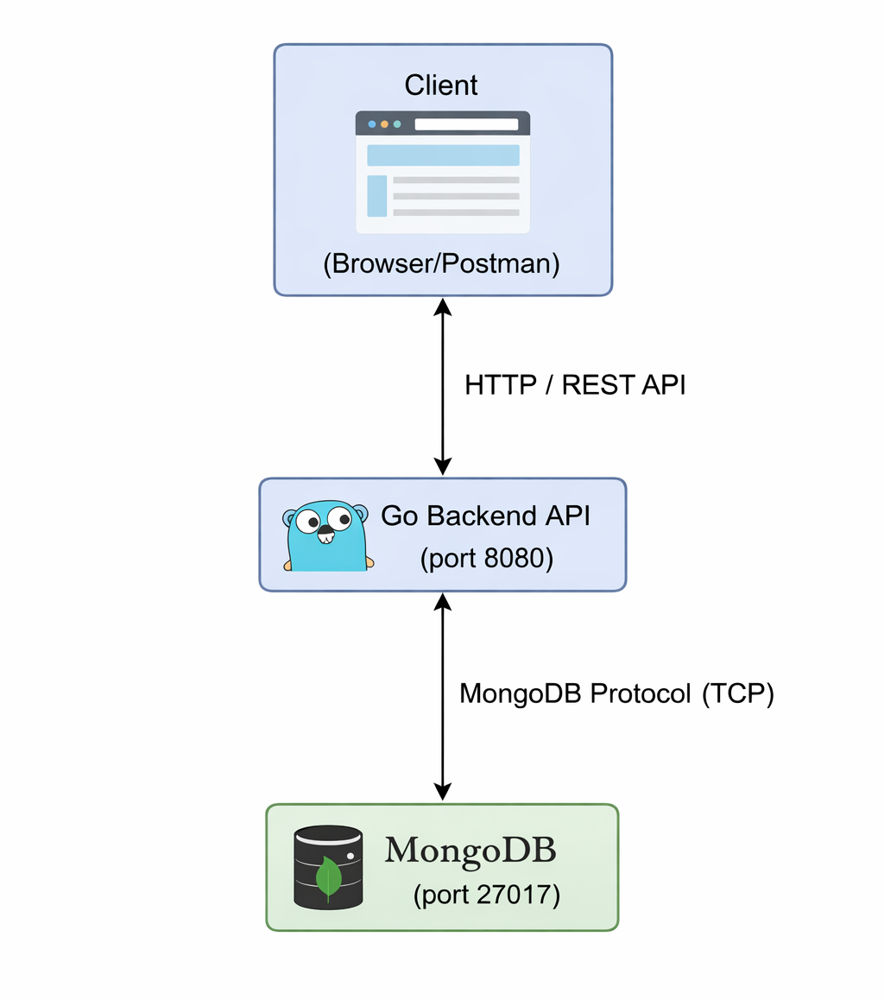

# CSC581 – Cloud Computing Project  
# Personalized Recipe Suggestion Engine

A containerized microservice that suggests recipes based on a list of available ingredients.  
Built with **Go** (backend API) + **MongoDB** (recipe storage), orchestrated using Docker Compose.

## Vision

The system consists of two main components:

- **Go Backend API**  
  A custom HTTP server that exposes a REST endpoint (e.g., `POST /recipes/suggest`).  
  It receives a list of ingredients from the client and returns a list of matching recipe suggestions.

- **MongoDB Database**  
  Stores a collection of recipes (name, ingredients, instructions, tags, etc.).

**How they communicate**:  
The Go backend connects to MongoDB using the official MongoDB Go driver over TCP (default port 27017).  
All interaction is done via standard MongoDB protocol — no shared volumes or message queues needed.

### Architecture Diagram

*(Click the image to view full size. The diagram is also saved in editable format.)*
## Proposal

### Planned Components and Base Images

- **Go Backend**  
  - Build stage base image: `golang:1.23-alpine`  
  - Final runtime image: `alpine:3.20` (or `scratch` for even smaller size)  
  - Approach: Multi-stage Dockerfile — compile the Go binary in the builder stage, then copy only the static binary into a minimal final image.  
  - Reason: Produces a very small, secure image with almost no dependencies or attack surface.

- **MongoDB**  
  - Base image: `mongo:7.0` (official image from Docker Hub)  
  - Reason: Stable, well-maintained, includes built-in healthcheck support, and is the standard choice for MongoDB deployments.

Both services will be defined and connected using a `docker-compose.yml` file, with proper dependency ordering, health checks, and networking.

This project will be fully containerized — no direct installations.  
Final demonstration will run on **CloudLab**.
