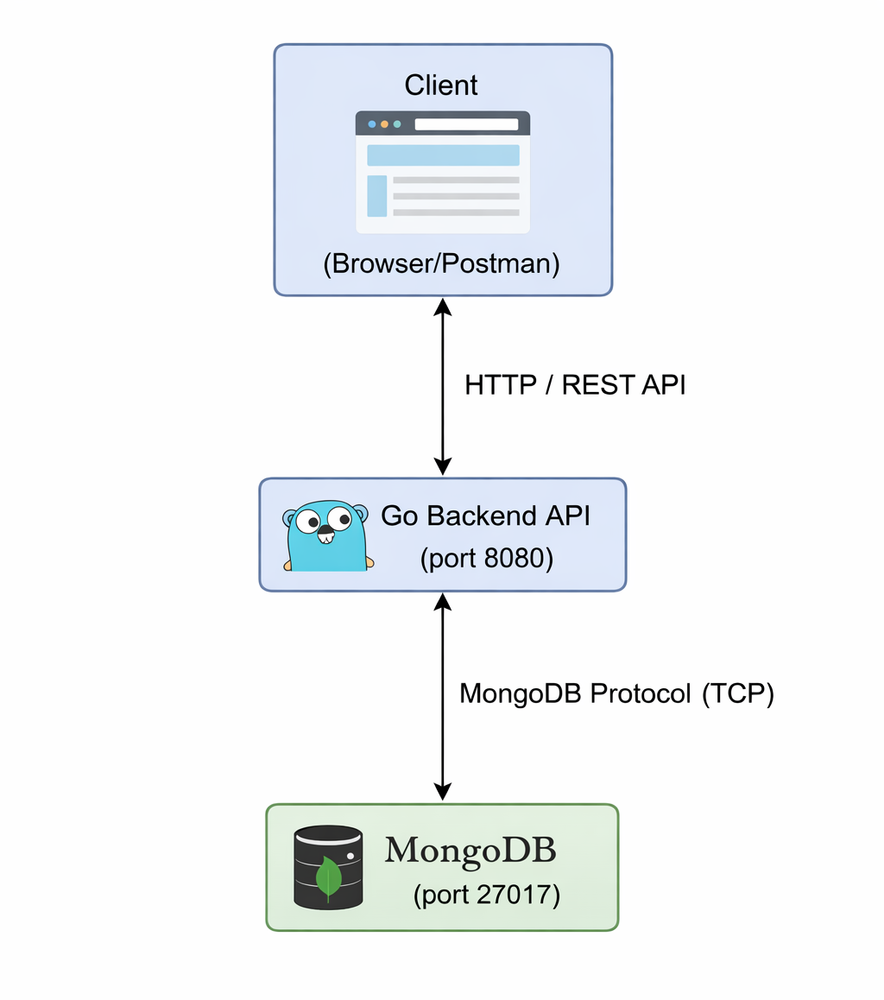

# CSC581 – Cloud Computing Project  
# Personalized Recipe Suggestion Engine

A containerized microservice that suggests recipes based on a list of available ingredients.  
Built with **Go** (backend API) + **MongoDB** (recipe storage), orchestrated using Docker Compose.

---

## Vision

The system consists of two main components:

- **Go Backend API**  
  A custom HTTP server that exposes a REST endpoint (e.g., `POST /recipes/suggest`).  
  It receives a list of ingredients from the client and returns a list of matching recipe suggestions.

- **MongoDB Database**  
  Stores a collection of recipes (name, ingredients, instructions, tags, etc.).

**How they communicate:**  
The Go backend connects to MongoDB using the official MongoDB Go driver over TCP (default port 27017).  
All interaction is done via the standard MongoDB protocol over Docker's internal bridge network.

### Architecture Diagram

*(Click the image to view full size.)*

---

## Proposal

### Planned Components and Base Images

- **Go Backend**
  - Base image: `golang:1.22-alpine`
  - Approach: Custom Dockerfile that compiles and runs the Go application inside a container.
  - Reason:
    - Lightweight image
    - Includes full Go toolchain
    - Alpine Linux reduces container size and attack surface

- **MongoDB**
  - Base image: `mongo:7.0` (official Docker image)
  - Reason:
    - Stable and widely used production image
    - Actively maintained
    - Standard choice for MongoDB deployments

Both services are defined and connected using a `docker-compose.yml` file.  
The entire system is fully containerized — no direct installations are required.

Final demonstration will run on **CloudLab**.

## Build Process

The backend service is containerized using a custom Dockerfile located in the `backend/` directory.

### Base Image Selection

The Dockerfile uses:

FROM golang:1.22-alpine

The golang:alpine image was selected for the following reasons:

- It is lightweight compared to full Linux distributions.
- It includes the complete Go compiler and build toolchain.
- Alpine Linux significantly reduces overall container size.
- It is commonly used in production-grade microservice architectures.

## Dockerfile Line-by-Line Explanation
FROM golang:1.22-alpine
WORKDIR /app
COPY go.mod ./
RUN go mod download
COPY . .
RUN go build -o recipe-engine
EXPOSE 8080
CMD ["./recipe-engine"]

Explanation:

FROM golang:1.22-alpine
Defines the base image containing the Go toolchain.
WORKDIR /app
Sets the working directory inside the container.
COPY go.mod ./
Copies the Go module definition file first to leverage Docker layer caching.
RUN go mod download
Downloads all Go dependencies before copying the full source code.
This improves build efficiency and reduces rebuild time.
COPY . .
Copies the remaining source code into the container.
RUN go build -o recipe-engine
Compiles the Go application into a binary executable.
EXPOSE 8080
Documents that the container listens on port 8080.
CMD ["./recipe-engine"]
Specifies the default command that runs when the container starts.

### Networking

Docker Compose automatically creates a dedicated bridge network when the application is started.

When running:

docker compose up

Docker performs the following:

Creates a private bridge network.
Attaches both backend and mongodb containers to this network.
Provides built-in DNS resolution.

### Inter-Container Communication

Containers communicate using their service names as hostnames.

For example, the backend connects to MongoDB using:

mongodb:27017

Docker automatically resolves mongodb to the correct container IP address.

This eliminates the need to manually manage IP addresses and simulates real-world microservice communication.

### Port Publishing

The docker-compose.yml file exposes:

8080:8080 → Allows external access to the backend API.
27017:27017 → Allows access to MongoDB for development and testing.

Internally, containers communicate through the private bridge network without exposing traffic to the host system.

This architecture mirrors real-world containerized deployments in Kubernetes and cloud platforms.
